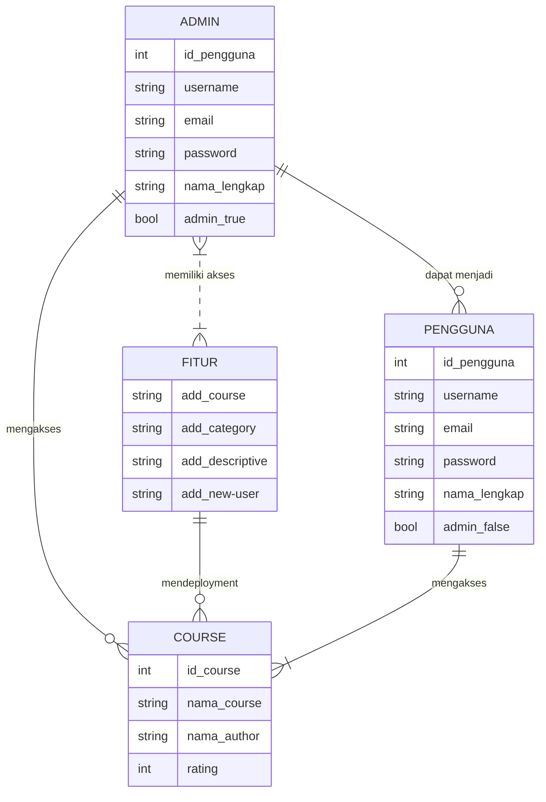
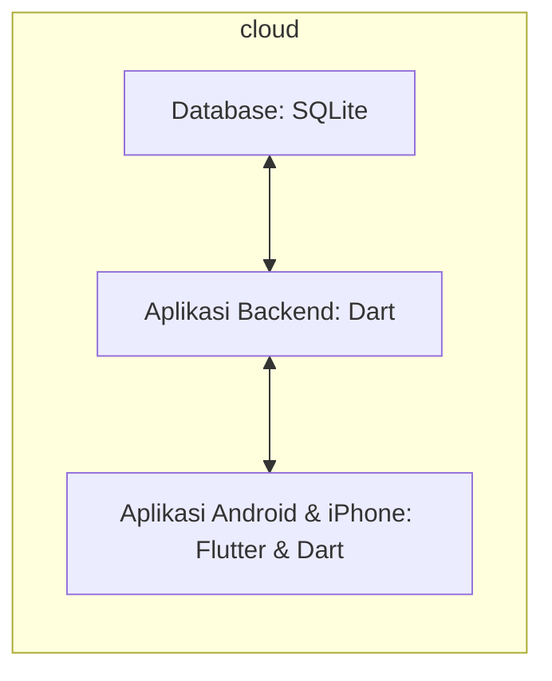

## 1.1 Latar Belakang
Dalam era digital ini, penguasaan pemrograman menjadi semakin penting, tetapi tidak semua mahasiswa baru Teknik Informatika Universitas Islam Negeri Sunan (UIN) Gunung Djati Bandung memiliki keterampilan coding. Ini merupakan hambatan bagi mereka yang ingin mengikuti perkembangan teknologi. Oleh karena itu, kami merasa ada kebutuhan untuk menciptakan sebuah solusi yang memungkinkan mahasiswa baru belajar coding dengan mudah,efektif dan jarak jauh. Maka dari itulah mengapa kami menciptakan aplikasi Code.in.

## 1.2. Deksripsi Teknologi Informasi
Aplikasi ecourse kami adalah solusi inovatif untuk mahasiswa baru Teknik Informatika Universitas Islam Negeri Sunan (UIN) Gunung Djati Bandung maupun semua kalangan yang ingin mempelajari coding tanpa kesulitan. Aplikasi ini menawarkan:
- Video kursus belajar coding yang disusun dengan baik untuk pemula.
- Video tutorial interaktif yang memandu langkah demi langkah.
- Latihan coding yang memungkinkan pengguna berlatih secara langsung. 
- Dukungan komunitas untuk berkolaborasi dan berdiskusi.

## 1.3. Branding
Nama Produk: Code.in
Logo: Logo Code.in mencerminkan kombinasi yang baik antara teknologi (laptop) dan jalan (portal). Ikonnya adalah komputer yang memiliki lampu di dalam layar laptop. yang dimana ini adalah sebuah logo yang mencerminkan kita memulai masuk ke dunia perkodingan melalui portal yang akan di suguhkan dalam monitor laptop sebuah lampu dengan ciri khas code yang mengekspersikan aplikasi ini adalah titik terang bagi mereka yang mau belajar coding mulai dari awal.

Slogan: "Menguasai Coding, Mulai dari Nol!"
Warna: Kombinasi biru dan hijau turquoise dengan latar hitam memberikan kesan elegant yang menjadi ciri bahwa aplikasi ini menjadi lebih berkesan
Misi: Misi Code.in adalah membantu mahasiswa semester 1 menjadi mahir dalam coding, membuka peluang baru dalam teknologi, dan menciptakan komunitas yang kuat.

Dengan Code.in, kami berkomitmen untuk menghilangkan hambatan akses ke dunia coding bagi mahasiswa semester 1 dan membantu mereka mencapai potensi penuh mereka dalam teknologi.

Logo Code.In

## 2. User Story

Sebagai | Saya ingin bisa | Sehingga | Prioritas
---|---|---|---
Pengguna | Mendapat materi kursus | saya bisa mendapatkan video interaktif kursus coding dari level basic | ⭐⭐⭐⭐⭐
Pengguna | berpartisipasi dalam latihan coding | saya bisa mempraktikkan keterampilan pemrograman yang saya pelajari dari video kursus | ⭐⭐⭐⭐
Pengguna | Mendapat materi diluar coding | menambah wawasan dalam ilmu informatika atau bidang lainnya | ⭐⭐⭐
Pengguna | Mencari video kursus berdasarkan topik | saya bisa dengan cepat menemukan materi yang relevan dengan apa yang saya pelajari | ⭐⭐⭐⭐⭐
Pengguna | Mendapatkan rekomendasi kursus berdasarkan minat saya | saya dapat menemukan kursus yang sesuai dengan minat dan tujuan belajar saya | ⭐⭐⭐⭐
Pengguna | Mengikuti alur coding | saya dapat menguji dan meningkatkan keterampilan pemrograman saya melalui alur yang tersistematis dan teratur. | ⭐⭐⭐⭐
Pengguna | Mengajukan pertanyaan dalam forum komunitas | saya bisa meminta bantuan dan berbagi pengetahuan dengan sesama pengguna Code.in | ⭐⭐⭐
Pengguna | Mengikuti kelas-kelas pemrograman secara live. | saya bisa menghadiri sesi live untuk interaksi langsung dengan instruktur. | ⭐⭐⭐⭐
Pengguna | Memilih bahasa pemrograman yang ingin saya pelajari | saya bisa fokus pada bahasa pemrograman tertentu yang saya minati | ⭐⭐⭐⭐
Pengguna | Mendapatkan notifikasi | mendapatkan notifikasi ketika video kursus terbit | ⭐⭐⭐
Pengguna | Menambahkan wstlist video kursus | bisa memasukan video ke wistlist untuk memudahkan pengguna | ⭐⭐
Pengguna | Faforitkan video kursus | bisa memudahkan video kursus yang di faforitkan oleh user | ⭐⭐
Pengguna | Mengganti username | Pengguna bisa mencustom username sesuai dengan keinginan | ⭐
Pengguna | Mengganti foto profil | pengguna bisa mengganti foto profil sesuai keinginan pengguna | ⭐
Pengguna | Melihat rating video Kursus | pengguna bisa melihat video kursus yang lebih baik sesuai dengan rating yang ada pada video tersebut. | ⭐⭐
Pengguna | Membaca deskripsi video kursus | Pengguna bisa melihat secara ringkas tentang isi dari video yang ada pada video kursus | ⭐⭐
Pengguna | Melihat durasi playlist | user bisa mengetahui durasi playlist yang akan mereka pilih | ⭐⭐
Pengguna | Melihat author kursus | user bisa mengetahui siapa author yang membuat video kursus tersebut  | ⭐
Pengguna | Memilih isi playlist video | pengguna bisa melihat semua video yang ada pada playlist tersebut | ⭐⭐⭐
Pengguna | Melihat kategori kursus | user mudah memilah video kursus yang sesuai dengan kategori video tersebut | ⭐⭐⭐
Pengguna | Mencari judul video kursus | memudahkan pengguna untuk mencari judul dari video yang ingin pengguna cari | ⭐⭐
Pengguna | Mencari judul menggunakan voice note | Sehingga bisa mencari judul menggunakan suara dari user | ⭐⭐
Pengguna | Berinteraksi dengan admin | user bisa berinteraksi langsung dengan admin tentang semua yang terkait dengan aplikasi | ⭐⭐⭐
Pengguna | Dapat menilai atau memberikan umpan balik pada kategori kursus | sehingga pengguna lain dapat melihat nilai dari rating pengguna-pengguna sebelumnya | ⭐⭐⭐
Admin | Menambahkan video kursus | User bisa mendapatkan video kursus dan admin bisa mengupload video yang dia inginkan untuk kebutuhan user | ⭐⭐⭐⭐
Admin | menambahkan kategori kursus | admin bisa menambahkan kategori guna membantu user untuk memudahkan mencari video kursus | ⭐⭐⭐
Admin | dapat mengedit kategori kursus yang sudah ada | Sehingga saya dapat memperbarui informasi kategori yang relevan. | ⭐⭐
Admin | Memiliki opsi untuk menghapus kategori kursus | Sehingga admin dapat mengelola daftar kategori yang ada | ⭐⭐
Admin | Mendokumentasikan setiap kategori kursus dengan deskripsi singkat | Pengguna dapat memahami isi kategori tersebut | ⭐⭐
Admin | Melihat statistik penggunaan setiap kategori kursus | sehingga Admin dapat mengevaluasi popularitasnya. | ⭐
Admin | Mengelompokkan beberapa kategori kursus menjadi subkategori | struktur kategori akan terorganisir | ⭐⭐
Admin | mengaktifkan atau menonaktifkan kategori kursus | sehingga saya dapat mengendalikan visibilitasnya | ⭐
Admin | memberikan tag atau kata kunci pada setiap kategori kursus | pengguna dapat menemukan kategori berdasarkan kata kunci tertentu. | ⭐
Admin | memiliki fitur pencarian dalam daftar kategori kursus | dapat dengan cepat menemukan kategori tertentu | ⭐⭐
Admin | menetapkan tingkat kesulitan atau level untuk setiap kategori kursus | pengguna dapat mengetahui dan memilih sesuai dengan kemampuan mereka | ⭐⭐
Admin | mengatur waktu publikasi untuk setiap video kursus | video kursus dapat muncul atau disembunyikan pada waktu yang ditentukan. | ⭐
Admin | memberikan deskripsi terperinci untuk setiap kategori kursus | pengguna dapat memahami kontennya sebelum memilih. | ⭐⭐
Admin | Bisa memberikan tautan ke forum atau komunitas yang terkait dengan setiap video kursus | Pengguna dapat berdiskusi dan berbagi pengalaman | ⭐⭐⭐

## 3. Struktur Data

## 4. Arsitektur Sistem

## 5. Teknologi, Library, dan Framework

Berdasarkan latar belakang dan deskripsi produk, berikut adalah deskripsi teknologi, library, dan framework yang mungkin digunakan dalam membangun aplikasi ecourse "Code.in":

## Bahasa Pemrograman / teknologi 
Aplikasi ini dibangun menggunakan bahasa pemrograman Dart. Dart adalah bahasa yang sangat serbaguna dan memiliki banyak penggunaan dalam pengembangan perangkat lunak, terutama dalam pembuatan aplikasi berbasis Flutter. Flutter adalah kerangka kerja (framework) yang dikembangkan oleh Google, yang memungkinkan pengembang untuk membuat aplikasi lintas platform dengan antarmuka pengguna yang menarik.
Dart dipilih sebagai bahasa pemrograman utama untuk Flutter karena memiliki berbagai keunggulan. Beberapa fitur utama Dart yang membuatnya cocok untuk pengembangan aplikasi berbasis Flutter meliputi: 
1. Kode Bersifat Mudah Di Kelola
Dart memiliki sintaks yang bersih dan mudah dipahami, sehingga memudahkan pengembang dalam mengelola dan memelihara kode.
2. Kinerja Mumpuni
Dart memiliki kinerja tinggi, yang sangat penting untuk aplikasi mobile yang responsif dan lancar. 
3. Komunitas Yang Berkembang
Dart dan Flutter memiliki komunitas pengembang yang berkembang pesat, yang berarti Anda dapat dengan mudah menemukan dukungan dan sumber daya yang diperlukan.

## Framework 
Code.in adalah sebuah aplikasi yang dibangun dengan menggunakan framework Flutter. Framework Flutter adalah salah satu framework pengembangan aplikasi mobile yang sangat populer dan efisien. Pengembang memilih Flutter karena memiliki banyak keunggulan, terutama ketika datang ke pengembangan aplikasi lintas platform, seperti Android dan iOS/iPhone. Dan juga salah satu keuntungan utama Flutter adalah kemampuannya untuk menghasilkan aplikasi yang berjalan di berbagai platform, termasuk Android dan iOS. Ini berarti pengembang dapat menghemat waktu dan usaha yang seharusnya digunakan untuk mengembangkan aplikasi terpisah untuk setiap platform. Deployment bersamaan ke Android dan iOS mengurangi kerumitan dan biaya pengembangan.

## Library 
Code.in menghadirkan berbagai video kursus dan tutorial interaktif dengan menggunakan library yang diambil dari YouTube melalui API. Pemilihan penggunaan YouTube API sebagai sumber utama video kursus memiliki beberapa keuntungan yang signifikan. 
Dengan menggunakan YouTube API, Code.in dapat memberikan video kursus yang selalu terkini dan terbaru kepada pengguna. YouTube adalah platform yang penuh dengan konten edukatif, dan dengan API ini, Code.in dapat secara otomatis menyinkronkan video terbaru tanpa perlu mengunggah ulang atau menyimpan video secara lokal. Ini memastikan bahwa pengguna selalu mendapatkan akses ke materi yang up-to-date. Menggunakan YouTube API mengurangi beban pada database Code.in. Pengembang tidak perlu menyimpan video secara lokal atau mengelola server khusus untuk menyimpan video. Ini menghemat sumber daya server dan infrastruktur, sehingga Code.in dapat berfokus pada memberikan pengalaman pengguna yang lebih baik. 
Dengan memanfaatkan YouTube API, Code.in dapat menghadirkan pengalaman belajar yang kaya, dinamis, dan up-to-date kepada pengguna tanpa perlu mengatasi masalah pengelolaan video secara lokal. Ini adalah pilihan yang cerdas untuk mengoptimalkan sumber daya dan meningkatkan kualitas layanan yang diberikan kepada pengguna.

## 6. Desain User Experience dan User Interface

Bisa load image 
.jpg)

## 7. Demonstrasi Video

Link youtube nya

## 8. Bagaimana mesin komputasi dan sistem operasi berperan dalam produk teknologi informasimu ?

Link youtube nya di detik jawaban ini

## 9. Bagaimana algoritma, struktur data, dan bahasa pemrograman berperan dalam produk teknologi informasimu ?

Link youtube nya di detik jawaban ini

## 10. Bagaimana metode pengembangan perangkat lunak / Software Development Life Cycle berperan dalam produk teknologi informasimu ?

Link youtube nya di detik jawaban ini

## 11. Bagaimana database / sistem basis data berperan dalam produk teknologi informasimu ?

Link youtube nya di detik jawaban ini
