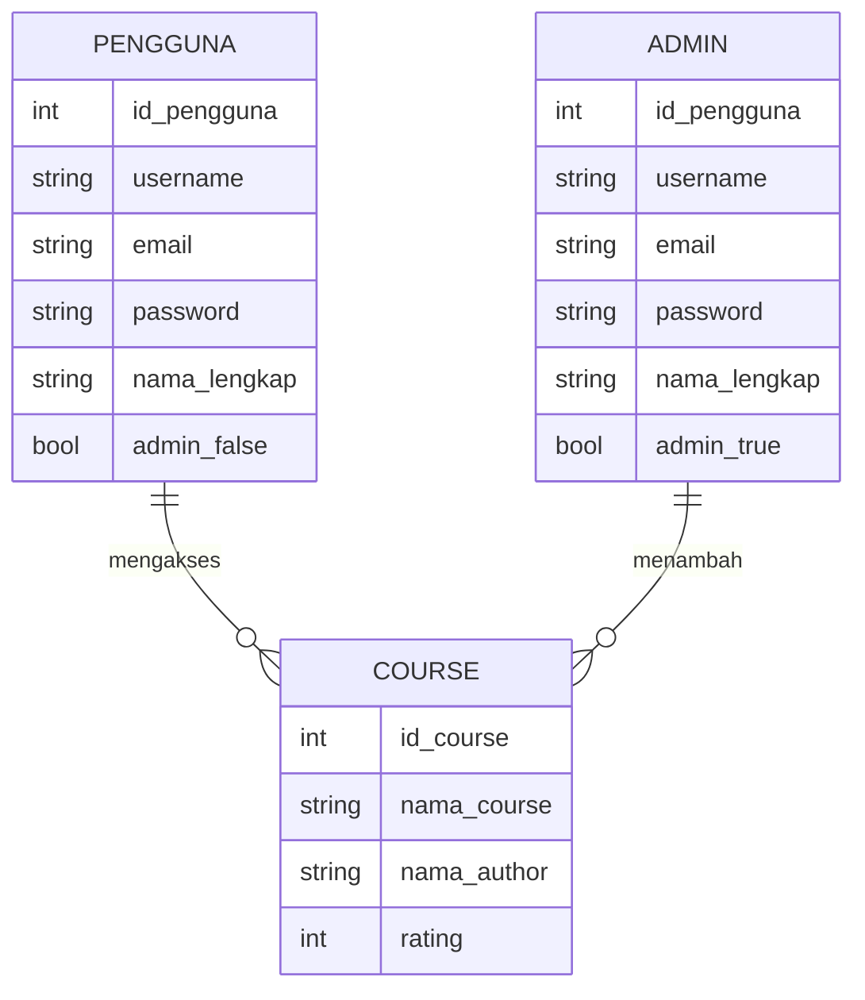
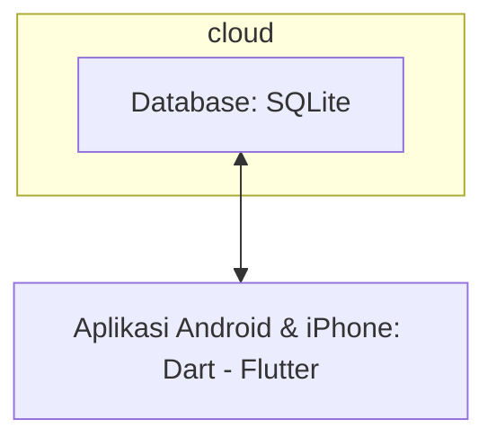

## 1.1 Latar Belakang
Dalam era digital ini, penguasaan pemrograman menjadi semakin penting, tetapi tidak semua mahasiswa baru Teknik Informatika Universitas Islam Negeri Sunan (UIN) Gunung Djati Bandung memiliki keterampilan coding. Ini merupakan hambatan bagi mereka yang ingin mengikuti perkembangan teknologi. Oleh karena itu, kami merasa ada kebutuhan untuk menciptakan sebuah solusi yang memungkinkan mahasiswa baru belajar coding dengan mudah,efektif dan jarak jauh. Maka dari itulah mengapa kami menciptakan aplikasi Code.in.

## 1.2. Deksripsi Teknologi Informasi
Aplikasi ecourse kami adalah solusi inovatif untuk mahasiswa baru Teknik Informatika Universitas Islam Negeri Sunan (UIN) Gunung Djati Bandung maupun semua kalangan yang ingin mempelajari coding tanpa kesulitan. Aplikasi ini menawarkan:
- Video kursus belajar coding yang disusun dengan baik untuk pemula.
- Video tutorial interaktif yang memandu langkah demi langkah.
- Latihan coding yang memungkinkan pengguna berlatih secara langsung. 
- Dukungan komunitas untuk berkolaborasi dan berdiskusi.

## 1.3. Branding
Nama Produk: Code.in
Logo: Logo Code.in mencerminkan kombinasi yang baik antara buku (pengetahuan) dan kode (coding). Ikonnya adalah pena yang berubah menjadi kode komputer. Ini menggambarkan transformasi mahasiswa menjadi ahli dalam coding.

Slogan: "Menguasai Coding, Mulai dari Nol!"
Warna: Kombinasi biru dan hijau yang memberikan kesan tenang dan inovatif.
Misi: Misi Code.in adalah membantu mahasiswa semester 1 menjadi mahir dalam coding, membuka peluang baru dalam teknologi, dan menciptakan komunitas yang kuat.

Dengan Code.in, kami berkomitmen untuk menghilangkan hambatan akses ke dunia coding bagi mahasiswa semester 1 dan membantu mereka mencapai potensi penuh mereka dalam teknologi.

Logonya

Nama Produk: Code.in

Logo: Logo Code.in mencerminkan kombinasi yang baik antara buku (pengetahuan) dan kode (coding). Ikonnya adalah pena yang berubah menjadi kode komputer. Ini menggambarkan transformasi mahasiswa menjadi ahli dalam coding.

## 2. User Story

Sebagai | Saya ingin bisa | Sehingga | Prioritas
---|---|---|---
Pengguna | mendapat materi kursus | saya bisa mendapatkan video interaktif kursus coding dari level basic | ⭐⭐⭐⭐⭐
Pengguna | berpartisipasi dalam latihan coding | saya bisa mempraktikkan keterampilan pemrograman yang saya pelajari dari video kursus | ⭐⭐⭐⭐
Pengguna | mendapat materi diluar coding | menambah wawasan dalam ilmu informatika atau bidang lainnya | ⭐⭐⭐
Pengguna | mencari video kursus berdasarkan topik | saya bisa dengan cepat menemukan materi yang relevan dengan apa yang saya pelajari | ⭐⭐⭐⭐⭐
Pengguna | mendapatkan rekomendasi kursus berdasarkan minat saya | saya dapat menemukan kursus yang sesuai dengan minat dan tujuan belajar saya | ⭐⭐⭐⭐
Pengguna | mengikuti alur coding | saya dapat menguji dan meningkatkan keterampilan pemrograman saya melalui alur yang tersistematis dan teratur. | ⭐⭐⭐⭐
Pengguna | mengajukan pertanyaan dalam forum komunitas | saya bisa meminta bantuan dan berbagi pengetahuan dengan sesama pengguna Code.in | ⭐⭐⭐
Pengguna | mengikuti kelas-kelas pemrograman secara live. | saya bisa menghadiri sesi live untuk interaksi langsung dengan instruktur. | ⭐⭐⭐⭐
Pengguna | memilih bahasa pemrograman yang ingin saya pelajari | saya bisa fokus pada bahasa pemrograman tertentu yang saya minati | ⭐⭐⭐⭐

## 3. Struktur Data

## 4. Arsitektur Sistem

Masih pake mermaid.js juga bisa lihat flowchart di [https://mermaid.js.org/syntax/flowchart.html](https://mermaid.js.org/syntax/flowchart.html)

## 5. Teknologi, Library, dan Framework

Berdasarkan latar belakang dan deskripsi produk, berikut adalah deskripsi teknologi, library, dan framework yang mungkin digunakan dalam membangun aplikasi ecourse "Code.in":

## Bahasa Pemrograman / teknologi 
Aplikasi ini menggunakan bahasa yaitu Dart. Dart juga merupakan bahasa yang digunakan dalam pengembangan perangkat lunak berbasis flutter.

## Framework 
code.in dibangun dengan framework flutter. developer menggunakan bahasa ini agar bisa deployment bersamaan di aplikasi android dan juga iOs/iphone sehingga irit tenaga dan juga waktu pengerjaan. 

## Library 
Untuk menyediakan video kursus dan tutorial interaktif, Code.in menggunakan library yang diambil dari youtube yaitu dengan API sehingga memudahkan developer untuk memasukan video course dan juga irit Database.

## 6. Desain User Experience dan User Interface

Bisa load image 
.jpg)

## 7. Demonstrasi Video

Link youtube nya

## 8. Bagaimana mesin komputasi dan sistem operasi berperan dalam produk teknologi informasimu ?

Link youtube nya di detik jawaban ini

## 9. Bagaimana algoritma, struktur data, dan bahasa pemrograman berperan dalam produk teknologi informasimu ?

Link youtube nya di detik jawaban ini

## 10. Bagaimana metode pengembangan perangkat lunak / Software Development Life Cycle berperan dalam produk teknologi informasimu ?

Link youtube nya di detik jawaban ini

## 11. Bagaimana database / sistem basis data berperan dalam produk teknologi informasimu ?

Link youtube nya di detik jawaban ini
